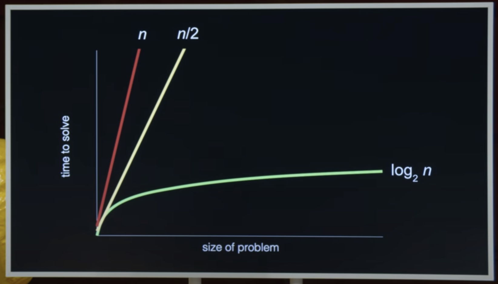

# Harvard CS50x 2024: Lecture 0 - Scratch

Completed 7th April 2024

[CS50x 2024 - Lecture 0 - Scratch](https://www.youtube.com/watch?v=3LPJfIKxwWc&ab_channel=CS50) - by David Malan

## Table of Contents

### General Notes

Computer science is very broad, general way of thinking. CS can feel like there's a lot of information - you can't absorb it all. With practice and time you can get comfortable along the way (even years!).

**Languages in CS50:** C, Python, SQL, JavaScript

CS50 focuses on:

-   Teaching _how to program, not specific languages_
-   How to solve problems
-   Learn how to represent numbers, letters, colours, images, videos & audio
-   Learn how to write algorithms (with code)

### What is CS?

The study of information, solving problems using certain ideas and techniques. Problem solving is a goal, which will be achieved through learning "computational thinking" (methodical, careful way of problem solving). CS helps you to think through problems cleanly and precisely.

Problem solving can be simiplified to input > [process] > output

Before we start, we have to figure out how to represent inputs/outputs

Unary notation (using your fingers to count!). Using a combination of fingers up and down, David can count up to 31.

### Binary === base-2 (2 values)

Example of electricity, either device is plugged in or not. **Bit** means binary digit. Lightbulb being on is 1, lightbulb off is 0. This is the agreed standard, could have been flipped!

In terms of hardware, each transistor represents a switch. In binary, the permutations are what matter, meaning which ones are on or off. So [x][o] is different than [o][x] from a transitor perspective. There's a system to represent how numbers from switches work (some students knew how to show 3, 4, 5, 6, 7) using 3 lightbulbs.

Base-ten decimal system we learn in school helps us read 123 as one hundred and twenty three because we know the order of the 1, 10, and 100 coloumns. Base-ten meaning 10^2, 10^1, 10^0 (start right to left) and onwards.

Changing from base-ten to base-one gives us (start right to left) 2^2, 2^1, 2^0, giving us 4, 2, 1. So 4 + 2 on equals 6, 4 + 1 equals 5, 2 + 1 equals 3. Given 3 lightbulbs you can't show 8 as you need more hardware (bits).

We can also use bits to represent instructions (as well as numbers). Spot (Boston Dynamics robot) programmed to represent certain patterns as up, down, converting bits into instructions. All hardware comes down to intepreting 0s and 1s into instructions.

3 bits isn't actually too useful, more often hear the term 'byte' which represents 8 bits. This is a more useful unit to use. 2^3. 00000000 represents zero. 11111111 represents: 255 (calculated it correctly!).

#### Byte Sum Calculations

2^0 = 1
2^1 = 2
2^2 = 4
2^3 = 8
2^4 = 16
2^5 = 32
2^6 = 64
2^7 = 128

### Converting bits into letters: Assigning Values

In order to convert bits into letters, we've given each letter a number value. The system is based on the number 65, so Capital A is represented in bits through transistors being off/on to sum to the number 65. Typically this would use a byte (8 bits) even if not all are needed as a a convention, so 01000001 translates to 65 (2^6 + 2^0).

This system of using bits for letters is known as (mic-drop) **ASCII**. The A (American) is relevant as languages other than english may have more than 256 characters (256 characters being represented by 0 through 255 in a single byte).

Spelling words: 72, 73, 33 spells (HI!). 66, 79, 87 (BOW).

Emoji are represented by characters in the same way as the alphabet. This is implemented through Unicode, which is a superset of ASCII. Instead of using 8 bits/1 byte per character, it uses between 16 bits/2 bytes and 32 bits/4 bytes per character, giving us the ability to represent up to 4 billion different emojis.

Instead of using binary to represent unicode, we use unicode code-point (base-16/hexadecimal). So an emoji is represented by U+1F602.

We can also modify emoji characters, e.g. thumbs up is U+1F44D, to change the skin-tone you use the same pattern under the hood, but provide an additional pattern of U+1F3FD, representing the 'middle' emoji. This can be extended futher by combining different emojis together, e.g. women + heart + man or man + heart + man or vice versa. Thus represented by stringing different unicode characters together.

### Converting bits into colours: RGB

Computers represent colours with 3 different colours, red, green, blue, which together can show every possible colour. Each dot on a computer screen is a pixel, and each pixel under the hood as 3 numbers associated with it. Each of those 3 numbers say how much Red, Green or Blue should be shown in that location. E.g. 72, 73, 33 is a light yellow.

Depending on the context, the computer will interpret the bits in a different way, e.g. 72,73,33 is HI! in a text message, yellow in PhotoShop, etc.

The program (and therefore the programmer) tells the computer how to interpret those instructions. Each pixel is showing 3 bytes/24 bits. This means a photo that is 3 megabytes (3 million bytes) is a million pixels, as 3 bytes are needed for each pixels colours.

### Representing music as bits: Notes/sound/duration/volume

A byte for each note/sound/duration/volume.

### Videos as bits

Videos are quickly moving pictures (e.g. 30, 60fps) so same picture approach applies.

## Algorithms: Problem Solving

Step by step instructions for solving some problem. Code is the implementation in computers of algorithms (which can exist in the physical world as abstract ideas as easily as in computers).

**Phonebook Example:** To find someone named "John Harvard" you could turn each page 1 by 1 looking for John, which is an algorithm (a step by step process). This would eventually find John, however is very slow. Even though it's slow, it's still correct.

One of the goals with writing code is to **solve the problem correctly.**

You could try and speed up this process by turning 2 pages at once, e.g. 2, 4, 6, 8. This would be faster as more pages are turned, however it's not longer correct — you might miss John if he's not on the page chosen. You could then turn back once you get to K, if required, making it correct again and still faster.

**Instead of this approach, companies like Apple and Google approach the problem by skipping to the middle of the list, immediately jumping to a point like M, helping orientate the search much faster.** This let's us throw away results that are immediately not relevant, e.g. everything from M onwards (as we know J is before M in the alphabet). You can then repeat this, halving the results, finding where you are, throwing away again until you have a small group of data to search from.

Given 1000 pages, you can find the correct page in roughly 10 searches (compared to 1000 pages, 1 at a time). We can then calculate the complexity of this algorithm based on an n^x ratio based on the time to solve vs size of problem.

Efficiently and well designed algorithms scale and handle different inputs in the future, e.g. 2000 pages in the phonebook in the future.

This graph only shows the efficiency and design of an algorithm, not necessarily the correctness.

## Pseudocode: Precisely describing a problem solving approach

1. Pick up phone book
2. Open to middle of phone book
3. Look at page
4. If person is on page
    1. (True) Call person
5. Else if person is earlier in book
    1. Open to middle of left half of book
    2. Go back to line 3
6. Else if person is later in book
    1. Open to middle of right half of book
    2. Go back to line 3
7. Else
    1. Quit _(e.g. if John Harvard isn't in the book at all!)_

Psuedocode (regardless of who wrote it) will have some key characteristics:

-   **Functions:** e.g. pick up, open to, look at are actions
-   **Conditionals:** Forks in the road based on
-   **Boolean expressions:** True or false statements
-   **Loops:** Execute commands on a cycle

## Artificial Intelligence

Instead of using infinite if/else statements to answer queries, LLMs (large language models) takes an input of lots of language, and then infers from the patterns of language what kinds of questions people might ask. E.g. if 90% of training data responds "good thanks, how are you?" to the question "how are you" we can use this to design an algorithm that infers the result using probability.

Goal for CS50 - to only use CS50's AI software (which can act as a tutor), rather than other solutions, which can take away learning benefits

[cs50.ai - Chatbot with guardrails to help as a tutor, not answers](https://cs50.ai/chat)

## Scratch Tutorial

Assignment https://cs50.harvard.edu/x/2024/psets/0/scratch/
Submission https://scratch.mit.edu/projects/996577749
Automated tests passed 8/8
